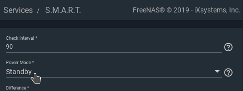

# freenas-spindown-timer
_Monitors drive I/O and forces HDD spindown after a given idle period. Resistant to S.M.A.R.T. reads._

Disk spindown has always been an issue for various FreeNAS users. This script utilizes `iostat` to
detect I/O operations (reads, writes) on each disk. If a disk didn't receive reads or writes for a
given period of time it is considered idle and gets spun down.

This *excludes* periodic reads of S.M.A.R.T. data performed by the smartctl service which
therefore enables users to have S.M.A.R.T. reporting turned on while still being able to
automatically spin down disks. The script also is immune to the periodic disk temperature
reads in newer versions of FreeNAS.

Currently tested on `FreeNAS-11.2-U4.1`.

## Key Features
  * Periodic S.M.A.R.T. reads don't reset the idle timers
  * Configurable idle timeout and poll interval
  * Support for ATA and SCSI devices
  * Per-disk idle timer / Independent spindown
  * Ignoring of specific drives (e.g. SSD with system dataset)
  * Runnable via `Tasks` as `Post-Init Script`, configurable trough FreeNAS GUI
  * Allows script placement on encrypted pool

## Usage
```
Usage: spindown_timer.sh [-h] [-q] [-v] [-d] [-t TIMEOUT] [-p POLL_TIME] [-i DRIVE]

A drive is considered as idle and is spun down if there has been no I/O
operations on it for at least TIMEOUT seconds. I/O requests are detected
during intervals with a length of POLL_TIME seconds. Detected reads or
writes reset the drives timer back to TIMEOUT.

Options:
  -q           : Quiet mode. Outputs are suppressed if flag is present.
  -v           : Verbose mode. Prints additonal information during execution.
  -d           : Dry run. No actual spindown is performed.
  -t TIMEOUT   : Number of seconds to wait for I/O in total before considering
                 a drive as idle.
  -p POLL_TIME : Number of seconds to wait for I/O during a single iostat call.
  -i DRIVE     : Ignores the given drive and never issue a spindown for it.
                 Multiple drives can be ignores by repeating the -i switch.
  -h           : Print this help message.
```

## Deployment and configuration
The following steps describe how to configure FreeNAS and setup the script.

### Configure disk-standby aware S.M.A.R.T.
To prevent the smartctl daemon from waking up already spun down disks open the FreeNAS
GUI and navigate to `Services > S.M.A.R.T. > Configure`:


Set `Power Mode` to `Standby` and save changes:



### Deploy script
Copy the script to your NAS and set the execute permission trough `chmod +x spindown_timer.sh`.

That's it! The script can now be run, i.e. in a `tmux` session. However, an automatic start
during FreeNAS's boot sequence is highly recommended (see next section).

### Automatic start at boot
There are multiple ways to enbale the spindown timer after startup. The easiest one probably is
to register it as an `Init Script` within the FreeNAS GUI. This can be done by opening the GUI
and navigating to `Tasks > Init/Shutdown Scripts` and creating a new `Post Init` task that
executes `spindown_timer.sh` after boot.


_Note: Be sure to select `Command` as `Type`_

#### Delayed start (i.e. script placed in encrypted pool)
If you've placed the script at a location that is not available right after boot a delayed start
of the spindown timer is required. This for example applies to situations where the script is
located inside an encrypted pool which needs to be unlocked prior to execution.

To automatically delay the start until the script file becomes available the helper script
`delayed_start.sh` is provided. It takes the full path to the spindown timer script as it's
first argument. Additional arguments are passed to the called script once available. Example
usage: `./delayed_start.sh /mnt/pool/spindown_timer.sh -t 3600 -p 600`

The `delayed_start.sh` script however must again be placed in a location that is available right
after boot. To circumvent this problem you can also use the following one-liner directly from an
`Init/Shutdown Script` as shown in the screenshot below. Set `SCRIPT` to the path where the 
`spindown_timer.sh` file is stored and configure all desired call arguments trough setting them
in the `ARGS` variable. The `CHECK` variable determines the delay between execution attempts in
seconds.

```bash
/bin/bash -c 'SCRIPT="/mnt/pool/spindown_timer.sh"; ARGS="-t 3600 -p 600"; CHECK=60; while true; do if [ -f "${SCRIPT}" ]; then ${SCRIPT} ${ARGS}; break; else sleep ${CHECK}; fi; done'
```


_Note: Be sure to select `Command` as `Type`_

#### Verify autostart
You can verify execution of the script either using a process manager like `htop` or simply by using the following command: `ps -aux | grep "spindown_timer.sh"`

When using a delayed start keep in mind that it might take some seconds before the script availability is updated and the spindown timer is finally executed.

## Bug reports and contributions
Bug report and contributions are welcome! Feel free to open a new issue or submit a merge request :)

## Attributions
The script is heavily inspired by: [https://serverfault.com/a/969252](https://serverfault.com/a/969252)

## Support
My work helped you in some way or you just like it? Awesome!

If you want to support me you can consider buying me a cofee/tea/mate. Thank You! <3

[](https://ko-fi.com/A0A3XX87)
